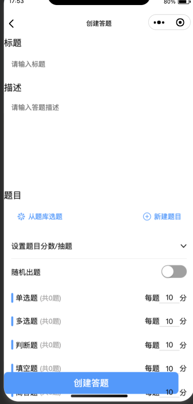
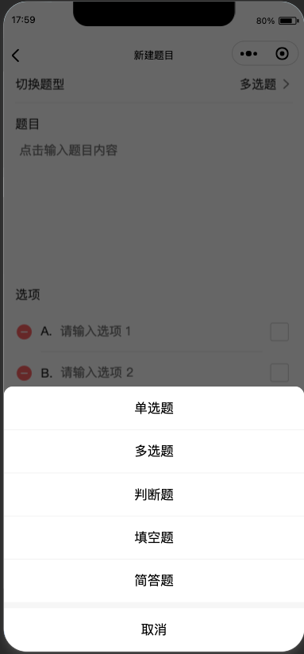
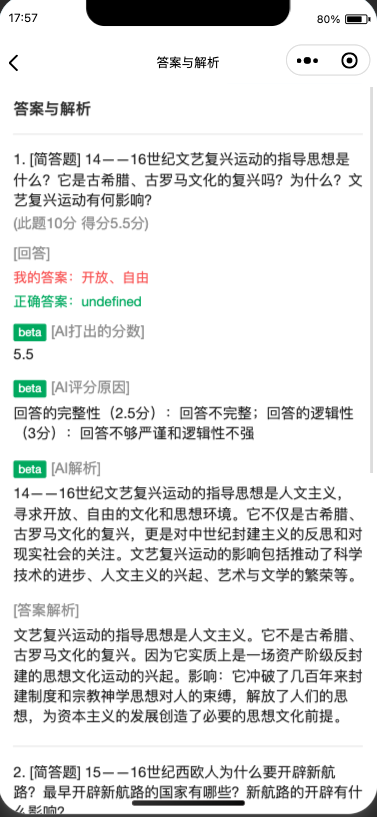

# online-quiz-uniapp

> 声明：此项目为大学毕业设计，基于 Uniapp 实现的在线答题小程序，只实现了部分核心功能；基于 MIT 协议，免费且作为开源学习使用。








- [online-quiz-uniapp](#online-quiz-uniapp)
  - [介绍](#介绍)
  - [主要技术](#主要技术)
  - [已实现功能](#已实现功能)
  - [待实现功能](#待实现功能)
  - [前置要求](#前置要求)
    - [前端](#前端)
    - [后端](#后端)
    - [MySQL`^8`](#MySQL`^8`)
  - [环境变量](#环境变量)
  - [运行](#运行)
  - [部署](#部署)
  - [License](#license)

## 介绍

一个基于 uni-app 的包含前后端的在线答题小程序。主要模块有在线答题、题库管理、自动批改、团队等。

## 主要技术

- 前端：uni-app，TuniaoUI
- 后端：Node.js，Express，MySQL，Sequelize

## 已实现功能

[✓] 登录/注册

[✓] 新建题库/新建答题

[✓] 答题

[✓] 答题评分/AI 评分简答题

[✓] 创建团队/加入团队

## 待实现功能

[✗] 验证码注册（目前无需验证码）

[✗] 优化首页推荐

[✗] 答题搜索

[✗] 答题中状态监控（防作弊）

[✗] 简答题加入标准答案供 AI 参考评分

[✗] 团队相关（目前只实现了创建和加入）

[✗] More...

## 前置要求

### 前端

- Hbuilder X，此项目前端需要通过 Hbuilder X 运行

### 后端

- Node，建议`node` 版本不低于`^14`，使用 [nvm](https://github.com/nvm-sh/nvm) 可管理本地多个 `node` 版本

```shell
node -v
```

- **安装依赖**：进入`/server`，然后执行`npm install` 或 `yarn` 或 `pnpm install`

### MySQL`^8`

将根目录下`sql.sql`导入到 `mysql`，可通过 workbench 导入。

> 注意：sql 文件会直接创建名为`online_quiz`的数据库，因此你无需创建数据库，直接运行命令即可

## 环境变量

进入 `/server` 后找到 `.env.example`，将其重命名为 `.env`，然后填入相关变量。

- `mysql` 配置(必填)：

  - `MYSQL_HOST`：数据库地址，如：`localhost`
  - `MYSQL_PORT` 数据库端口，如：`3306`
  - `MYSQL_USER` 数据库用户名，如：`root`
  - `MYSQL_PASSWORD` 数据库密码

- `阿里云OSS对象存储`配置（不填则无法上传图片）：
  - `ACCESS_TOKEN_SECRET`
  - `OSS_REGION`
  - `OSS_ACCESS_KEY_ID`
  - `OSS_ACCESS_KEY_SECRET`
  - `OSS_BUCKET`

详细字段请自行上阿里云 OSS 对象存储查阅

- `OPENAI`配置（AI 简答题打分，无需 AI 打分可不填）
  - `CHATGPT_HOST`：chatgpt 请求地址，如：`https://chat.openai.com`，也可填写转发地址
  - `CHATGPT_API_KEY` APIKEY，`sk-xxxxxxxx`

## 运行

- **前端**：打开`Hbuilder X`，`运行->运行到小程序模拟器`
- **后端**：进入`/server`，终端运行`node index`，看到`数据库连接成功`即可，默认端口为 `3000`
- **数据库**：需要运行`mysql`

## 部署

前端通过`Hbuilder X`发布小程序，后端将`/server`拷贝到服务器运行 `node index`，数据库将 `sql.sql` 导入到服务器 mysql，然后清空数据。

## License

MIT © [Boson](./license)
